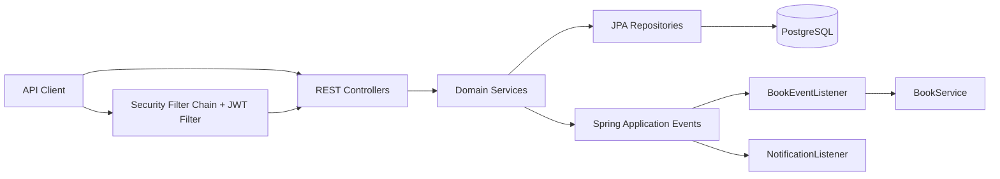
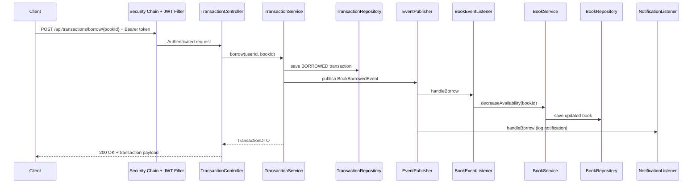

# Library Application Architecture

## 1. Purpose and Scope
This document describes the architecture of the Library Application built with Spring Boot. It captures:
- Module boundaries and responsibilities
- Runtime request and security flow
- Domain and persistence model
- Event-driven interactions
- Key design decisions and known gaps

## 2. System Context
The application is a backend service for library management. It provides APIs for:
- Authentication and JWT issuance
- Book catalog management and search
- Borrow/return transaction workflows
- User management and profile access

Primary external dependencies:
- PostgreSQL (runtime persistence)
- H2 (test-only persistence)
- OpenAPI/Swagger UI consumers

## 3. Technology Stack
- Java 21
- Spring Boot 3.5.13
- Spring Web (REST APIs)
- Spring Data JPA + Hibernate
- Spring Security + JWT (jjwt)
- Spring Validation
- Spring Modulith dependencies (present in build)
- OpenAPI via springdoc
- Lombok
- Maven

## 4. High-Level Architecture
The codebase follows a modular monolith style organized by domain packages.

- auth: authentication, JWT, user principal mapping, security filter
- book: book API, domain, repository, service, event listener for copy adjustments
- transaction: borrow/return API, domain, repository, service, event publication
- user: user API, domain, repository, service
- notification: event listeners for borrow/return logs
- shared: base entity and common exception handling
- config: CORS, Jackson, OpenAPI

### 4.1 Layering Pattern
Each domain generally follows:
- api: REST controllers and DTOs
- internal: services, repositories, listeners, business logic
- domain: JPA entities and enums

## 5. Package Structure
Top-level package: com.library

- com.library.auth
  - api
  - config
  - internal
- com.library.book
  - api
  - domain
  - internal
- com.library.transaction
  - api
  - domain
  - event
  - internal
- com.library.user
  - api
  - domain
  - internal
- com.library.notification
  - domain
  - internal
- com.library.shared
  - base
  - exception
- com.library.config

## 6. Component View

## 7. Runtime Flow
### 7.1 Authentication and Authorization
1. Client calls POST /auth/login with email and password.
2. AuthService authenticates via AuthenticationManager.
3. On success, JwtUtil generates JWT token.
4. For protected endpoints, JwtFilter reads Authorization header.
5. JwtFilter validates token and loads UserDetails via CustomUserDetailsService.
6. SecurityContext is populated with UserPrincipal authorities.
7. Method-level rules are enforced through @PreAuthorize (enabled by @EnableMethodSecurity).

### 7.2 Borrow Book Flow
1. Client calls POST /api/transactions/borrow/{bookId}.
2. TransactionService validates active borrow count (max 3).
3. Transaction is persisted with BORROWED status.
4. BookBorrowedEvent is published.
5. BookEventListener receives event and decreases available copies in BookService.
6. NotificationListener logs borrow notification.

### 7.3 Return Book Flow
1. Client calls POST /api/transactions/return/{bookId}.
2. TransactionService finds active BORROWED transaction.
3. Transaction is updated to RETURNED and returnDate is set.
4. BookReturnedEvent is published.
5. BookEventListener increases available copies.
6. NotificationListener logs return notification.

## 8. Domain Model
Core entities:
- User
  - id, name, email (unique), password, role
- Book
  - id, title, author, isbn (unique), totalCopies, availableCopies
- Transaction
  - id, userId, bookId, issueDate, returnDate, status
- Notification
  - id, message

All entities inherit BaseEntity:
- id
- createdAt
- updatedAt

### 8.1 Persistence Notes
- User and Book enforce uniqueness on email and isbn respectively.
- Transaction currently stores userId and bookId as scalar fields (not JPA relationships).
- createdAt and updatedAt are managed via @PrePersist/@PreUpdate.

## 9. API Surface Summary
- Auth APIs
  - POST /auth/login
  - GET /auth/test
- Book APIs
  - GET /api/books
  - GET /api/books/search?q=
  - POST /api/books (ADMIN)
  - PUT /api/books/{id} (ADMIN)
  - DELETE /api/books/{id} (ADMIN)
- Transaction APIs
  - POST /api/transactions/borrow/{bookId}
  - POST /api/transactions/return/{bookId}
  - GET /api/transactions
- User APIs
  - GET /api/users (ADMIN)
  - GET /api/users/{id} (ADMIN)
  - GET /api/users/me

## 10. Security Architecture
Security configuration highlights:
- Stateless session policy
- CSRF disabled
- /auth/** and /public/** permitted
- All other endpoints require authentication
- JWT filter runs before UsernamePasswordAuthenticationFilter
- Role checks use ROLE_* convention through UserPrincipal
- Method-level security enabled globally

## 11. Error Handling
- Business/domain errors use CustomException.
- GlobalExceptionHandler maps CustomException to HTTP 400 with message body.
- Non-CustomException runtime errors propagate through default Spring handling.

## 12. Configuration and Cross-Cutting Concerns
- DataSource/JPA
  - Runtime: PostgreSQL via application.yml
  - Test: H2 via test scope dependency and test properties
- CORS
  - Allows all origins, methods, and headers
- Serialization
  - Jackson configured to register modules and write date/time as ISO strings
- API Documentation
  - OpenAPI metadata exposed via springdoc

## 13. Architectural Strengths
- Clear domain-based package organization
- Simple and understandable service boundaries
- Event-driven decoupling between transaction processing and side-effects
- Stateless JWT security suitable for API clients
- Good testability through service/controller separation and DTO mapping

## 14. Known Gaps and Risks
- TransactionController currently maps authenticated user to a hardcoded userId (1L), which can cause authorization and data integrity issues.
- JwtFilter prints BCrypt hashes on each request, introducing noisy logs and avoidable CPU work.
- GlobalExceptionHandler maps only CustomException; other runtime exceptions may return generic 500 responses.
- Transaction entity uses scalar foreign keys instead of explicit JPA relationships, reducing referential expressiveness.
- CORS is fully open, which may be too permissive for production environments.

## 15. Recommended Next Improvements
1. Resolve authenticated user email to actual userId in TransactionController via UserService.
2. Remove debug password hash generation/logging from JwtFilter.
3. Expand global exception handling to include validation and not-found semantics with structured error responses.
4. Consider migrating Transaction.userId/bookId to @ManyToOne relations if domain complexity grows.
5. Restrict CORS origins and methods by environment profile.
6. Add architecture decision records (ADRs) for key choices (JWT strategy, event-driven updates, modular package structure).

## 16. Deployment and Runtime Considerations
- Packaging: executable Spring Boot jar
- Build: Maven
- Runtime dependencies: PostgreSQL, environment-specific JWT secret
- Operational recommendation: externalize sensitive settings (DB credentials, JWT secret) via environment variables or secret manager

## 17. Quick Reference: Sequence Diagram (Borrow)

